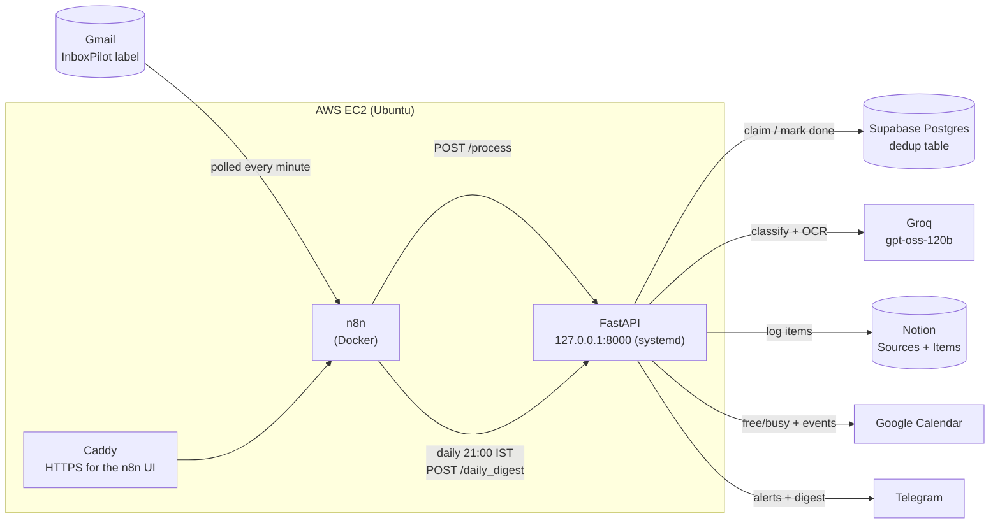

# 📬 InboxPilot

An email assistant for placement season: it reads the emails you label, logs them, schedules them, and only interrupts you when something needs a decision.

During placement season a student's inbox fills up with job postings, interview invites, drive notices and deadlines, mixed in with noise, and important dates get missed. InboxPilot classifies each labelled email with an LLM and logs it to a Notion tracker. It puts dated items on Google Calendar and sends a Telegram message only when a human needs to look at something. It is a single-user FastAPI backend, and an n8n workflow feeds it from Gmail.

## Architecture



The API listens only on `127.0.0.1`. n8n, on the same server, is its only caller, and Caddy exposes only the n8n UI.

## Features

- **Classification and extraction.** Each email is sorted into `job_opportunity`, `meeting`, `deadline` or `irrelevant`. The model also extracts the source, a title, the event date, the location or link, the priority and a short summary.
- **Attachments.** Text is extracted from PDF and DOCX files. If a scanned PDF has no text layer, it goes to a Groq vision model for OCR (at most 10 pages and 40 s per PDF).
- **Confidence score.** The score is computed by a fixed rubric from the uncertainty flags the model reports. The model is never asked how confident it is.
- **Notion tracker.** Items are linked to their sources, and each item has a status: `Scheduled`, `Needs review`, `Conflict` or `Logged only`.
- **Google Calendar.** Timed items get a free/busy conflict check before the event is created. Date-only deadlines become all-day events.
- **Telegram alerts, only when needed.** You get a message for low confidence, a calendar conflict, or a failed step.
- **Duplicate protection.** An atomic database claim stops the same email from being processed twice, even when two copies arrive at once.
- **Daily digest.** At 9 PM IST you get a Telegram summary of everything processed that day, grouped by category.

## Tech stack

| Layer | Tool |
|---|---|
| Service | Python 3.11+, FastAPI, Uvicorn |
| LLM | `openai/gpt-oss-120b` on Groq, with strict structured outputs (JSON schema) and `temperature=0`. The model is set by `GROQ_MODEL`. |
| OCR | A Groq vision model, used only for scanned PDFs |
| Output validation | Pydantic |
| Attachments | pdfplumber, python-docx |
| Retries | tenacity |
| Dedup store | Supabase Postgres, through SQLAlchemy Core |
| Tracker | Notion, through the data sources API (`notion-client` 3.x) |
| Calendar | Google Calendar API v3 (OAuth desktop client) |
| Notifications | Telegram Bot API |
| Orchestration | n8n, self-hosted in Docker |
| Hosting | AWS EC2 (Ubuntu), systemd, Caddy |

## How an email flows

n8n sends each labelled email to `POST /process` as JSON, with attachments in base64. Then:

1. **Claim.** The key is the Gmail message ID, or a SHA-256 of subject, sender and body if there is no ID. An atomic claim in Postgres either takes ownership of the email or returns `duplicate_skipped`.
2. **Extract attachments.** Each attachment is written to a random temp file, its text is extracted (with OCR if needed), and the file is always deleted.
3. **Classify.** The prompt includes the current IST date and time, so "tomorrow" resolves correctly. The model returns JSON that matches a strict schema.
4. **Validate.** Pydantic checks the output. A missing or unknown category fails the email, and other bad fields are replaced with safe defaults.
5. **Normalize the date.** A date-only value stays a date, and a datetime is converted to IST. An unparseable date is dropped and flagged `ambiguous_date`.
6. **Score confidence.** The score starts at 1.0. Each heavy flag subtracts 0.25, each light flag subtracts 0.10, and an unreadable attachment subtracts 0.25. Below 0.7, you get a Telegram alert and nothing is scheduled.
7. **Write to Notion.** The item is created with the status `Needs review` or `Logged only`.
8. **Mark done.** The email's dedup row is set to `done`.
9. **Calendar.** This step only runs for confident, dated items, and it is best-effort. A timed item gets a free/busy check and then a 1-hour event; a busy slot means a Telegram alert. A date-only item gets an all-day event.
10. **Sync the status.** The Notion item becomes `Scheduled` or `Conflict`.

If classification or the Notion write fails, you get a Telegram alert and the claim is released so the email can be retried. The response is still HTTP 200, with `status` set to `classification_failed` or `notion_write_failed`.

## Engineering highlights

- **Atomic claims that fail open.** A single `INSERT … ON CONFLICT … RETURNING` decides who owns an email, so two concurrent deliveries can't both run. A claim left behind by a crash is taken over after 10 minutes. If Supabase is down, the email is still processed and a Telegram warning goes out; it is never dropped.
- **Read and write retries are different.** Reads retry on rate limits, 5xx errors and timeouts. Writes (creating a Notion page, inserting a Calendar event) retry only on rate limits or when the request never left the machine. After a read timeout or a 5xx, the first write may have succeeded, and a retry could create a duplicate.
- **Strict schema plus validation.** Groq's strict mode guarantees the shape of the output. Pydantic validates it again, in case the model or strict mode changes. The schema's list of flags is built from the confidence rubric, so the two can't drift apart.
- **The order is Notion, then mark done, then Calendar.** The email is marked done right after the Notion write, so a later Calendar or Telegram failure can't cause a duplicate Notion item on retry. Calendar runs after Notion, so a failed Notion write never leaves an orphan event behind. Items start as `Needs review` and are promoted only once the event exists.
- **All-day deadlines.** The prompt tells the model never to invent a time. "Submit by Sep 28" stays a date and becomes a transparent all-day event that doesn't block the day, instead of a fake midnight meeting.
- **Privacy by design.** Only emails with the InboxPilot label reach the pipeline. The API binds to `127.0.0.1`, so nothing on the internet can call it.

## Project layout

```
inbox_pilot/
├── microservice/            # the FastAPI service (start it from here)
│   ├── main.py              # endpoints and pipeline orchestration
│   ├── classify.py          # Groq classification prompt and call
│   ├── schemas.py           # strict JSON schema and Pydantic validation
│   ├── dedup.py             # Postgres claim-based dedup
│   ├── retry_utils.py       # read/write retry policies
│   ├── notion.py, calendar_utils.py, telegram_utils.py, attachments.py, ...
│   ├── calendar_auth.py     # one-time Google OAuth, writes token.json
│   ├── test_*.py            # unit tests
│   ├── inboxpilot.service   # systemd unit (reference copy)
│   └── Caddyfile            # Caddy config (reference copy)
├── n8n/workflow.json        # export of the n8n workflow
├── docs/                    # GitHub Pages: privacy policy and terms
├── requirements.txt         # pinned dependencies
└── .env.example             # configuration template
```

## Setup

### Prerequisites

- Python 3.11 or newer (the server runs 3.12)
- A Groq API key
- A Notion integration and two databases (see below)
- A Postgres database. Supabase is used here.
- A Google Cloud project with the Calendar API enabled, an OAuth consent screen, and an OAuth **Desktop** client
- A Telegram bot (from @BotFather) and your chat ID
- n8n, for the full Gmail flow

### Install

From the repo root:

```bash
python -m venv venv
source venv/bin/activate          # Windows: venv\Scripts\activate
pip install -r requirements.txt
```

`requirements.txt` pins every package the code uses to the versions running in production.

### Configure

Copy `.env.example` to `.env`, either at the repo root or in `microservice/`, and fill it in. It lists every variable with a comment:
- Required: `GROQ_API_KEY`, `NOTION_TOKEN`, `NOTION_SOURCES_DB_ID`, `NOTION_ITEMS_DB_ID`, `TELEGRAM_BOT_TOKEN`, `TELEGRAM_CHAT_ID`, `DATABASE_URL`.
- Optional: `GROQ_MODEL`.

Notion and the database are contacted at startup, so the app won't start without valid values.

<details>
<summary>Notion databases</summary>

Property names are case-sensitive. Share both databases with your integration.

**Sources:** `Name` (title), `Category` (select), `Status` (select).

**Items:**

| Property | Type |
|---|---|
| `Title` | title |
| `source` | relation to Sources |
| `category` | select (`Job Opportunity`, `Meeting`, `Deadline`, `Other`) |
| `status` | select (`Scheduled`, `Needs review`, `Conflict`, `Logged only`) |
| `priority` | select (`High`, `Medium`, `Low`) |
| `event_date` | date |
| `location_or_link`, `source_email`, `attachment_summary`, `notes` | rich text |
| `confidence_score` | number |

</details>

<details>
<summary>Postgres dedup table</summary>

Run this once, for example in the Supabase SQL editor:

```sql
CREATE TABLE inboxpilot_v1_dedup (
    email_id     TEXT PRIMARY KEY,
    processed_at TIMESTAMPTZ NOT NULL DEFAULT now(),
    status       TEXT NOT NULL DEFAULT 'done' CHECK (status IN ('processing', 'done')),
    claimed_at   TIMESTAMPTZ NULL,
    claim_token  TEXT NULL
);
```

</details>

### Google Calendar OAuth

1. In Google Cloud, publish the OAuth consent screen to **Production**. In Testing mode, refresh tokens expire after 7 days.
2. Download the Desktop OAuth client JSON and save it as `microservice/credentials.json`.
3. Run the one-time auth on a machine with a browser:
   ```bash
   cd microservice
   python calendar_auth.py
   ```
   This writes `microservice/token.json`.
4. For a headless server, copy `token.json` and `credentials.json` into the server's `microservice/`. Without a token there, the OAuth flow would try to start inside a request.

Both files are gitignored.

### Run locally

```bash
cd microservice          # required: imports and credential paths are relative
uvicorn main:app --reload
```

Then open http://127.0.0.1:8000/docs. Calling the endpoints, including from `/docs`, uses your real Notion, Google Calendar and Telegram.

| Endpoint | Purpose |
|---|---|
| `POST /process` | JSON body (`subject`, `body`, `sender`, `gmail_message_id`, base64 `attachments`). This is the endpoint n8n calls. |
| `POST /process_with_attachment` | Multipart upload of one file, for manual testing |
| `POST /daily_digest` | Sends today's Telegram summary |

### n8n workflow

Import `n8n/workflow.json` into n8n, then:

- Reconnect the Gmail credential.
- Choose your own InboxPilot label in the Gmail Trigger, because label IDs differ per mailbox. Then create a Gmail filter that applies that label to the emails you want processed.
- Keep the HTTP Request timeout for `/process` at **600 s**. The worst case for one email is about 6 minutes, with a scanned PDF and every outside call slow.
- Keep the workflow timezone at `Asia/Kolkata`, so the digest runs at 21:00 IST.
- The HTTP Request nodes call `http://localhost:8000`. Change the URL if the API runs somewhere else.

### Tests

From `microservice/`:

```bash
python test_timezone_utils.py
python test_schemas.py
python test_retry_utils.py
python test_attachments.py
python try_classify.py        # 2 live Groq calls; needs GROQ_API_KEY
```

The four test files are plain unit tests. They make no network calls and don't need pytest, though they also run under it. `try_classify.py` is a manual check that the configured model and strict mode work.

## Deployment

- **One Ubuntu EC2 instance** (`ap-south-1`) runs the API, n8n and Caddy. Supabase, Groq, Notion, Google and Telegram are managed services.
- **API:** the systemd unit `inboxpilot` runs `uvicorn main:app --host 127.0.0.1 --port 8000` from `microservice/`, using `microservice/venv`, with `Restart=always`. The reference copy is [`microservice/inboxpilot.service`](microservice/inboxpilot.service).
- **n8n:** runs in Docker on port 5678, behind Caddy at `YOUR_SERVER_IP.nip.io`. nip.io gives the IP a hostname, so Caddy can get an HTTPS certificate. The reference copy is [`microservice/Caddyfile`](microservice/Caddyfile). Editing either reference copy does not change the server.
- **Secrets on the server:** `microservice/.env`, `credentials.json` and `token.json`.
- **Deploying:** push, then run `git pull` on the server. If `requirements.txt` changed, run `pip install -r requirements.txt` in the server's venv. Then run `sudo systemctl restart inboxpilot`. Logs are in `journalctl -u inboxpilot -f`. There is no CI/CD yet.

## Privacy

- **Ingestion is limited to one label.** A Gmail filter applies the InboxPilot label, and n8n watches only that label. Unrelated or confidential mail never reaches the pipeline or Groq.
- **What goes where:**
  - The subject, sender, body and attachment text of labelled emails are sent to Groq for classification.
  - The results go to my own Notion workspace, Google Calendar and Telegram chat.
  - The dedup table stores only the message ID (or a one-way hash), timestamps and a claim status. It never stores email content.
  - On the server, n8n keeps a history of recent runs, and the logs record subjects and senders.
- **The API isn't reachable from the internet.** It listens only on `127.0.0.1`.
- **Self-hosting the model was considered and put off.** Running a model with Ollama was evaluated, but the free-tier EC2 instance doesn't have enough RAM, and a bigger instance would cost far more.

Policies: [Privacy Policy](https://sourabh-550.github.io/inbox_pilot/privacy.html) · [Terms of Service](https://sourabh-550.github.io/inbox_pilot/terms.html)

## Lessons from running it in production

- **The model was retired.** Groq retired the Llama 3.3 model this service used, and production started returning `model_not_found`. The model name now lives in `GROQ_MODEL`, so the next retirement is only a config change.
- **Calendar broke every week.** Google OAuth apps in Testing mode expire refresh tokens after 7 days. Publishing the consent screen to Production fixed it, which required public privacy and terms pages.
- **A wrong-attachment bug was caught in review before it caused a problem.** While reviewing the workflow export before committing it, I found that the n8n Code node read attachments with index `0`. When one poll returned several emails, the later emails would have gotten the first email's attachment. It now uses `$itemIndex`, which was verified with two emails in one poll.
- **The 9 PM digest arrived at 6:30 AM.** n8n's workflow timezone defaulted to `America/New_York`. It is now set to `Asia/Kolkata`.

## Known limitations

- **Failed emails aren't retried automatically.** Failures return HTTP 200 with a `status` field, so n8n marks the run as succeeded. Re-sending is manual; the released claim lets the retry through.
- **Timed events are always 1 hour.** This includes timed deadlines, which also get a conflict check even though a deadline doesn't take up time.
- **An irrelevant email can still be scheduled.** Scheduling checks the date and the confidence, not the category, so an `irrelevant` email with a date can end up on the calendar.
- **Later attachments can be cut off.** The 10,000-character limit on attachment text applies after all attachments are joined together.
- **Requests have no size limit.** There is no limit on the size of a request or its attachments.
- **It serves one user.** There is one Notion workspace, one calendar and one Telegram chat, and the timezone is hard-coded to IST.

## Roadmap

- **Interactive Telegram bot:** act on items from the chat, instead of only receiving alerts
- **Deadline reminders** before items are due
- **Application tracker:** follow each job application from posting to outcome
- **Eligibility check:** compare a posting's criteria with my profile
- **Scam flag:** mark suspicious job offers
- **Evaluation set:** labelled emails to measure classification accuracy when the prompt or model changes
- **CI:** run the unit tests on every push
- **Reliability fixes for the limitations above:**
  - Return a non-200 status on failure, so n8n can retry.
  - Make calendar inserts idempotent.
  - Make scheduling depend on the category.
